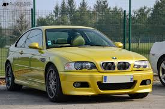
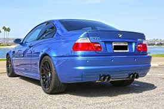

**BMW M3 e46 ** 



```
Produktionszeitraum:  2000-2006
Karosserieversionen:  Coupé, Cabriolet
Motoren:              Ottomotoren:
                      3,2 Liter (338–355 PS)
Länge:                4492 mm
Breite:               1780 mm
Radstand:             2731 mm
Leergewicht:          1219–1462 kg
Max. Gescwindichkeit: 250 km/h (electronischer Limit)/ 308 km/h
0-100 km/h:           5,1 sec
```
Der von Mitte 2000 bis Sommer 2006 gebaute M3 (E46) hat einen hochdrehenden 3,2-l-Reihensechszylinder-Motor, 
der 252 kW (343 PS) bei 7900 min−1 leistet. Das Fahrzeug gab es als Coupé (öffentliche Vorstellung: Mondial 
de l’Automobile 2000) und Cabrio (öffentliche Vorstellung: NAIAS 2001),[3] jeweils nur in der ursprünglichen 
Version, obwohl später dann auch Merkmale des beim E46 im Frühjahr 2003 erfolgten Facelifts mit eingearbeitet
wurden (wie zum Beispiel die LED-Rückleuchten). Von Alpina wird mit dem B3 und B3 S ebenfalls eine leistungsstarke 
Variante des E46 angeboten, die jedoch auf mehr Antriebskomfort ausgelegt ist.




